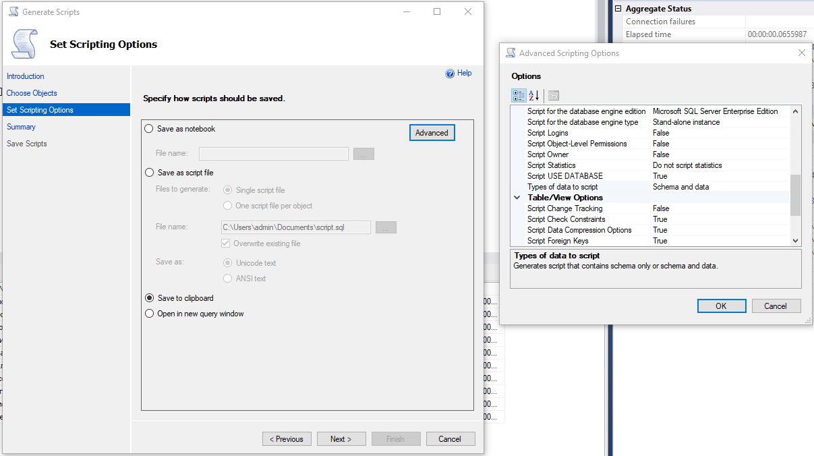

<h1 align="center">Work with Images example</h1>

## Description

**ReadDataConsoleApp** - Console application to read image bytes and save them to database (ssms)
**ImagesAPI** - Interaction with the database
**ImagesWpfApp** - Client app: direct connection and use of API

## Подходы и варианты подключения

**ImagesWpfApp** использует сразу два подхода взаимодействия с базой данных

### Прямое подключение

.NET Framework позволяет создать ADO.NET Entity Data Model (не работает для .NET Core)
При помощи контекста можно обращаться к данным, присваивать нужным элементам и менять их в пользовательском интерфейсе напрямую
Сохранение осуществляется через `await _context.SaveChangesAsync();`

### Взаимодействие с API

1. Используя.NET Core и проект ASP.NET Core Web API, необходимо установить некоторые пакеты для работы с БД:

- Microsoft.EntityFrameworkCore
- Microsoft.EntityFrameworkCore.SqlServer
- Microsoft.EntityFrameworkCore.Tools

2. Затем сканируем существующую базу данных следующей командой:

```bash
Scaffold-DbContext "Data Source=DESKTOP-GJJERNN;Initial Catalog=24wsImages;Integrated Security=True;TrustServerCertificate=True" Microsoft.EntityFrameworkCore.SqlServer -OutputDir Models/Db -force
```

3. Контекст созданной модели позволяет взаиможействовать с базой данных
4. Обращение к API с клиентского приложения осуществляется при помощи HTTP запросов

### Использование изображений

1. Прямое подключение с использованием конвертации byte[] to BitmapImage
2. Прямое подключение с использованием byte[] as .Source for Image tag 
3. Использование API, передача base64 string с дальнейшей конвертацией в byte[]
4. Использование локального хранилища изображений

## How to setup

1. Create your own database and run database script ./ImportData/DBScirpt.txt
2. Change connection strings (WPF & API)
3. Run solution

## Others

### Useful links

[ReadMe guide](https://gist.github.com/nikhilnayyar002/7a35e653d3d590e317c829243e73b110)

### Script entire database

1. Select database
2. Open context menu using RMB
3. Tasks => Generate Scripts
4. Follow the options below


